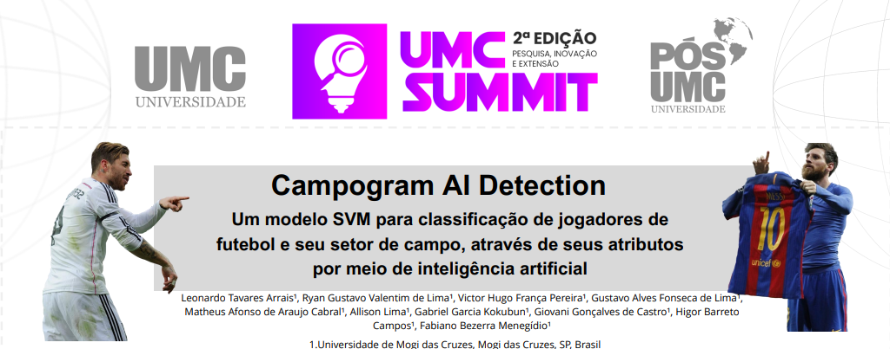

# Campogram AI - FIFA 14

<p>
  <a href="https://github.com/ProjectIA-Team/CampogramFIFA/blob/main/imagem_summit.png">
    
  </a>
</p>

## Descrição do Projeto

Este projeto utiliza uma base de dados de cartas de jogadores de futebol do jogo FIFA 14 para explorar e analisar os atributos dos jogadores. O foco desse projeto é realizar um treinamento de modelo baseado em Machine Learning (ML), através do algoritmo Support Vector Machine (SVM), visando a identificação de padrões dentro da dataset. O modelo tem como objetivo potencializar a descoberta da diferença de atributos entre os jogadores para prever a possível posição em campo daquele atleta.

A análise busca identificar quais atributos mais influenciam na classificação de um jogador em suas posições dentro do campo, como por exemplo o Atacante (ATA) (que possui características específicas como maior Chute e Drible) ou Defensor (ZAG) (com atributos de Defesa maiores). Através desse projeto, esperamos trazer insights sobre como os diferentes atributos impactam as classificações.

## Estrutura do Projeto

O projeto está dividido em duas partes principais:

1. **Parte 1: Descrição dos Features**
    - Nesta etapa, faremos uma análise detalhada dos features (características) de cada jogador incluído na base de dados.
    - Features principais:
      - `Geral`: A classificação geral do jogador no FIFA 14.
      - `Posição`: A posição que o jogador ocupa em campo (ex.: ATA, MEI, ZAG...).
      - **Atributos**:
        - `Geral`: Representa a nota geral do jogador.
        - `Velocidade`: Representa a velocidade do jogador.
        - `Finalização`: A habilidade do jogador para finalizar jogadas.
        - `Passe`: Capacidade de realizar passes precisos.
        - `Drible`: Habilidade de driblar oponente.
        - `Defesa`: Capacidade de defender e recuperar a bola.
        - `Físico`: Representa a força física e resistência do jogador.

2. **Parte 2: Descrição dos Dados**
    - Após a descrição dos features, partimos para a exploração dos dados propriamente ditos:
      - Análise estatística básica dos atributos dos jogadores.
      - Visualização gráfica dos atributos distribuídos por posição.
      - Análise de correlações entre os atributos dos jogadores.
      - Aplicação de técnicas de Machine Learning para identificar padrões e classificar os jogadores entre todas suas posições dentro de um campo de futebol.

## Ferramentas Utilizadas

Este projeto será desenvolvido utilizando as seguintes ferramentas:

- **Google Colab**: Para a preparação dos dados e implementação do modelo no notebook.
- **Python**: Linguagem principal para análise e modelagem.
- **Bibliotecas**:
  - `Pandas`: Para manipulação e análise dos dados.
  - `NumPy`: Para operações matemáticas.
  - `Matplotlib` e `Seaborn`: Para visualização dos dados.
  - `Scikit-learn`: Para a aplicação de algoritmos de Machine Learning.
  - **Técnicas de ML**:
    - `GridSearchCV`: Para otimização de hiperparâmetros dos modelos.
    - `Cross Validation`: Para validação cruzada do desempenho do modelo.
    - `Permutation Importance`: Para medir a importância dos atributos no modelo.


## Visualização de código

Para visualizar os códigos realizados, acesse pelo Google Colab ou seu ambiente Python preferido no seguinte tópico: "**Como Executar**".


## Como Executar

1. Clone este repositório:
    ```bash
    git clone https://github.com/ProjectIA-Team/CampogramFIFA.git
    ```

2. Instale as dependências necessárias:
    Acesse a aba "Downloads" para ter acesso às informações de instalação.

3. Abra o projeto no Google Colab ou seu ambiente Python preferido e siga as etapas nos notebooks fornecidos:
    - `UMC_Summit_CampogramIA.ipynb`: Este notebook demonstra a implementação de um modelo de Support Vector Machine (SVM) para prever a divisão de jogadores em suas posições no campo de futebol, dentro das categorias 'Ouro Raro' e 'Ouro não raro' , dentro de uma base de dados do FIFA.


## Contribuições

Contribuições são bem-vindas! Sinta-se à vontade para abrir um issue ou enviar um pull request.

## Licença

Este projeto está licenciado sob a [MIT License](LICENSE). Realizado em Mogi das Cruzes, São Paulo.

